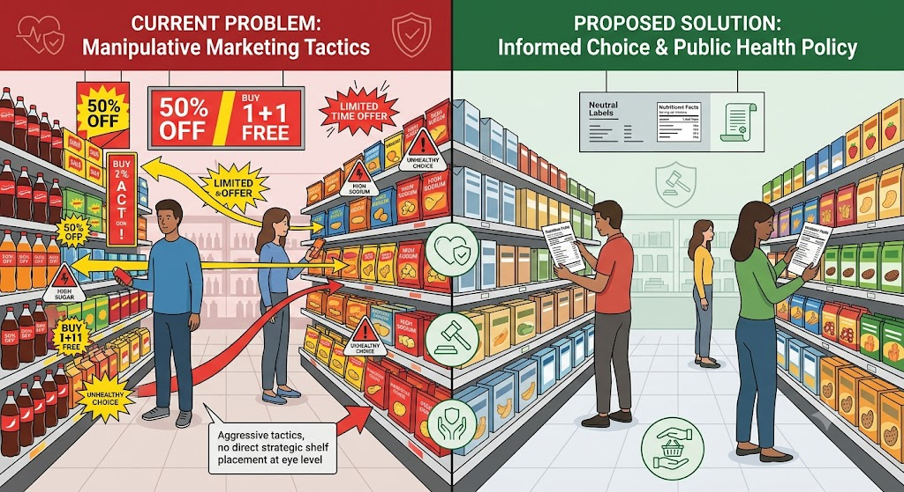

# 
מסמכי הצעת החוק

סעיף זה מכיל את המסמכים הקשורים להצעת החוק המוצעת.

## מסמכים

1. [📄 נוסח החוק המוצע](./hoq-taviot-adumot-nusach.md)
2. [📑 דברי הסבר](./divrei-hesber-murchavim.md)
3. [🌍 סקירה השוואתית – 12 מדינות](./skira-hashvaatit-12-medinot.md)

---

## ניווט מהיר

| מסמך | תיאור |
|------|-------|
| [נוסח החוק המוצע](./hoq-taviot-adumot-nusach.md) | נוסח מלא של החוק המוצע |
| [דברי הסבר](./divrei-hesber-murchavim.md) | הסבר מפורט של ההצעה |
| [סקירה השוואתית](./skira-hashvaatit-12-medinot.md) | השוואה לחקיקה ב-12 מדינות |

